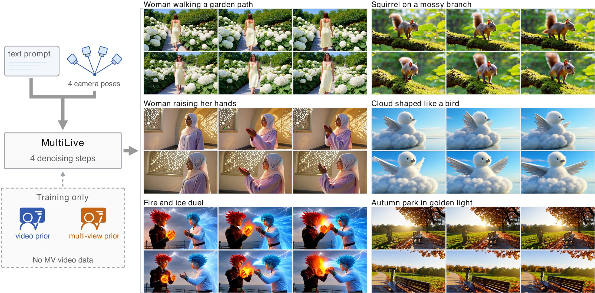

<h2 align="center">MultiLive: On-Policy Distillation of Video and Multi-View Priors for Multi-View Video Generation</h2>

  Yifan Niu1,2,* · Yang-Tian Sun1,3,*,† · Haoran Feng1,4 ·
  Lu Sheng2 · Yan-Pei Cao1,✉ · Zehuan Huang1,✉,†

  1VAST &nbsp; 2BUAA &nbsp; 3HKU &nbsp; 4THU 
  * Equal contribution · ✉ Corresponding authors · † Project leads

  <a href="https://vast-eden.ai/?p=multilive">Project Page</a>

MultiLive generates synchronized multi-view videos from text and camera conditions by distilling video and multi-view priors into a single generator.

## Highlights

- **No multi-view video training data required.** Uses separately learned video and multi-view priors.
- **Dual-teacher on-policy distillation.** Both teachers supervise the same student-generated sample for temporal and cross-view consistency.
- **4-step generation.** Jointly generates synchronized multi-view videos in 4 denoising steps.

## Code

Code coming soon.

